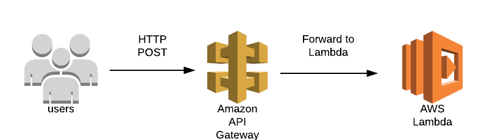

# API Gateway + Lambda Example

Setting up a serverless API on using AWS API Gateway + Lambda. I read this [article](https://www.alexdebrie.com/posts/aws-api-gateway-service-proxy/) on API Gateway and implemented the following setup:


I wrote a simple web application in Python and Go it has two endpoints the root `/` endpoint and the `/increment` endpoint. Both endpoints return the value of an in-memory counter. The `/increment` endpoint will increment the counter before returning it.

## Python

- Application written using FastAPI and [Mangum](https://pypi.org/project/mangum/) which connects API Gateway to FastAPI
- The [function.zip](./python/function.zip) contains the application code and all the dependencies. 
It was a little awkward copying all the dependencies but I wanted to deploy the function without using any other frameworks or libraries that would automate the deployment.


## Go

- Application written using [chi](https://github.com/go-chi/chi) and [awsapigatewayv2handler](https://github.com/a-h/awsapigatewayv2handler)

Building the executable for AWS:

```
set GOOS=linux
set GOARCH=amd64
set CGO_ENABLED=0

go build -o main cmd/aws/main.go
```

