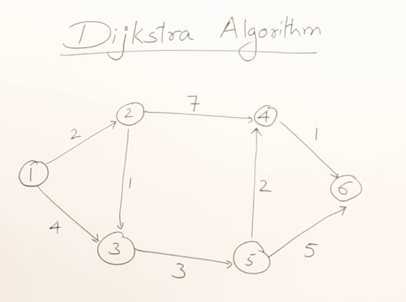
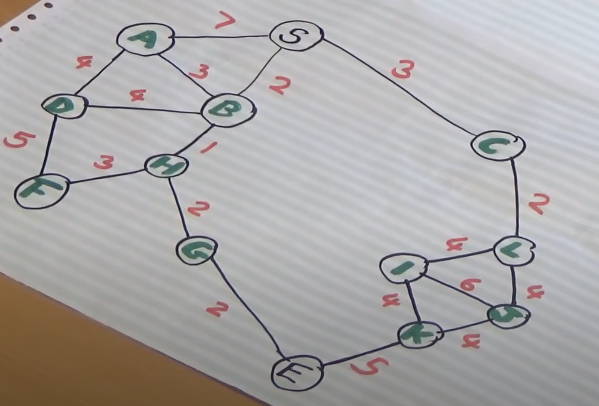

# Dijkstra's Algorithm Kotlin

Implemented in [Graphs.kt](./src/main/kotlin/Graphs.kt)

## Examples

[Abdul Bari video](https://www.youtube.com/watch?v=XB4MIexjvY0&ab_channel=AbdulBari)



```kotlin
println(graph.dijkstra("1", "4"))
"Order: 1 -> 2 -> 3 -> 5 -> 4 Cost: 8"
```

[Computerphile video](https://www.youtube.com/watch?v=GazC3A4OQTE&ab_channel=Computerphile)



```kotlin
println(graph.dijkstra("S", "E"))
"Order: S -> B -> H -> G -> E Cost: 7"
```